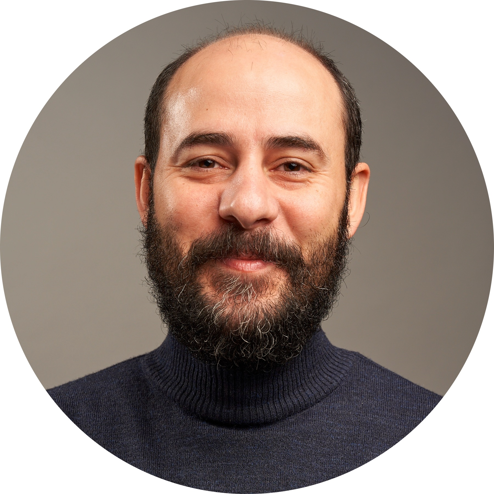

  

Hi, I'm Afon (Mohammad) Khari, a cognitive scientist with a background in **Brain and Cognitive Sciences**, **Philosophy**, and **Language Studies**. 

My interdisciplinary academic path has taken me from humanities to the frontiers of cognitive neuroscience and data modeling.

I recently graduated from the **University of Amsterdam** with an MSc in **Brain and Cognitive Sciences**, where I conducted research at the **Music Cognition Group**, the Institute for Logic, Language and Computation (**ILLC**), and the **Donders Institute for Brain, Cognition and Behavior**.

My work explores how brains adapt to complex environments, bridging analytical modeling and human experience to study **attention**, **perception**, and **learning** in dynamic, real-world contexts. I’m especially interested in how insights from **neuroscience** and **computational modeling** can inform **education**, **AI**, and **cognition**.

Feel free to explore my [CV](cv.html), check out my [research](research.html), or browse recent [publications](publications.html).
